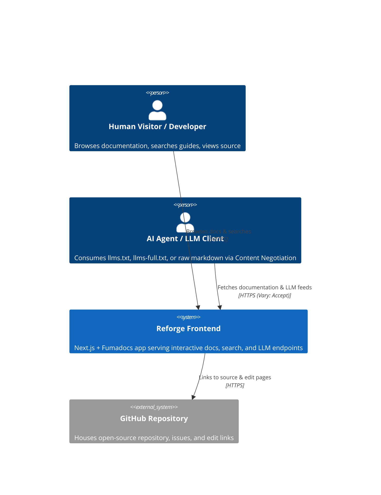
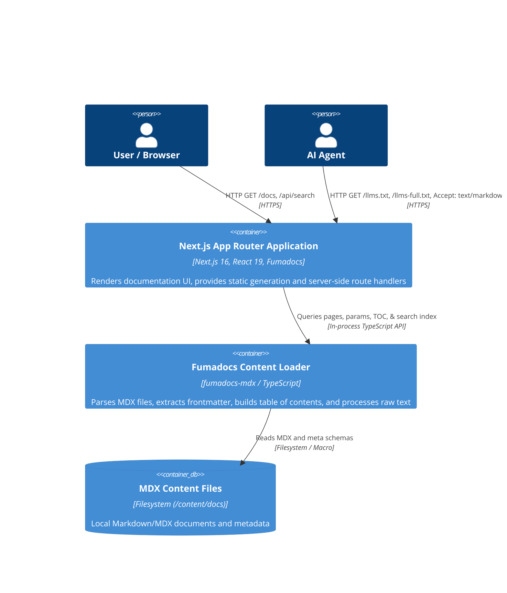
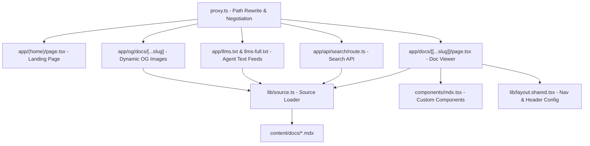

# Architecture — Reforge Frontend

> **Last updated:** 2026-09-16
> **Authors:** <!-- TODO: fill in author names -->
> **Status:** Current

## Overview

The Reforge Frontend application is a modern documentation and web platform built with Next.js 16 (App Router), React 19, Fumadocs, and Tailwind CSS v4. It delivers high-performance structured documentation, instant search, dynamic OpenGraph social preview images, and agent-accessible LLM markdown text feeds (`llms.txt`, `llms-full.txt`, and HTTP content negotiation proxies) for the Reforge ecosystem.

---

## Level 1 — System Context

The frontend serves human visitors via a responsive web UI and AI coding assistants via structured text endpoints and content negotiation.

**External dependencies:**

| System | Purpose | Owner | SLA |
| --- | --- | --- | --- |
| GitHub | Repository hosting, issue tracking, and document edit links | GitHub | 99.9% |
| npm Registry | Package distribution and dependencies | npm | 99.9% |

---

## Level 2 — Containers

The frontend is a deployable Next.js container containing static assets, server components, route handlers, and MDX content processing logic.

**Container inventory:**

| Container | Technology | Responsibility | Scales |
| --- | --- | --- | --- |
| Next.js Frontend | Next.js 16, React 19, Fumadocs UI, Tailwind CSS v4 | UI rendering, client navigation, search dialogs, OpenGraph generation | Horizontally (Serverless / Edge / Node.js) |
| Fumadocs Source Core | `fumadocs-core`, `fumadocs-mdx` | MDX parsing, type generation, search indexing, page tree generation | In-process build/runtime |
| Content Store | MDX Files (`content/docs/`) | Version-controlled technical documentation source | Static filesystem |

---

## Level 3 — Components

Component architecture within the Next.js application:

---

## Key Architectural Decisions

- **Fumadocs with MDX Macro**: Provides type-safe content collections, automatic search indexing, and high-performance server components without requiring a separate headless CMS.
- **LLM and AI Agent-First Endpoints**: Native support for `/llms.txt`, `/llms-full.txt`, and HTTP content negotiation (`Accept: text/markdown` via `proxy.ts`) to enable AI assistants to consume documentation cleanly.
- **Tailwind CSS v4 & Lucide Icons**: Modern styling infrastructure using the latest Tailwind CSS v4 PostCSS integration and Lucide React icons.

---

## Data Flow — Key Scenarios

### 1. Document Page Request & Rendering

`Browser → GET /docs/[...slug] → proxy.ts (pass-through) → app/docs/[[...slug]]/page.tsx → source.getPage(slug) → MDX Component Render → HTML + Client Hydration`

### 2. AI Content Negotiation Flow

`Agent → GET /docs/[...slug] (Accept: text/markdown) → proxy.ts (rewrites to /llms.mdx/docs/[...slug]/content.md) → app/llms.mdx/docs/[[...slug]]/route.ts → raw Markdown response`

### 3. Client Search Query Flow

`User types in Search Dialog → GET /api/search?query=... → app/api/search/route.ts (createFromSource) → Fumadocs in-memory search index → JSON search results returned`

---

## Infrastructure

| Environment | Platform | Region | Notes |
| --- | --- | --- | --- |
| Production | <!-- TODO: fill in e.g. Vercel / Cloudflare / Node.js --> | <!-- TODO: fill in --> | Serverless / Static output |
| Staging | <!-- TODO: fill in --> | <!-- TODO: fill in --> | Preview deployments |
| Local dev | Node.js (Next dev server) | Localhost (Port 3000) | Hot-reloading enabled |

---

## Non-Functional Characteristics

| Property | Target | Current |
| --- | --- | --- |
| First Contentful Paint (FCP) | < 1.0s | ~0.6s (local static) |
| Search API Latency | < 100ms | < 50ms (in-memory) |
| Markdown Negotiation Support | 100% route coverage | Supported on all `/docs` routes |

---

## Related Documents

- [ADR Index](docs/adr/)
- [Runbooks](docs/runbooks/)
- [Concepts](docs/concepts/)
- [AI Assistant Context](CONTEXT.md)
