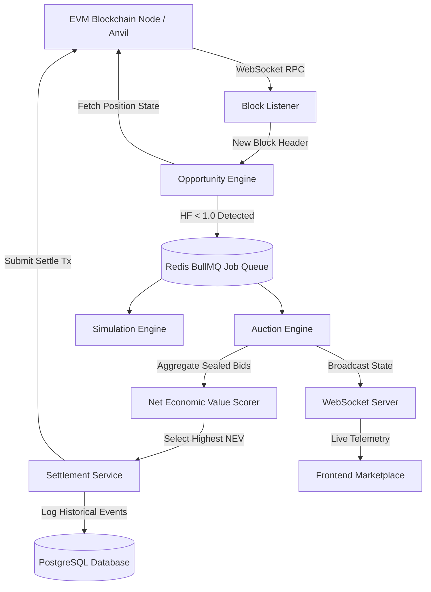

The Reforge backend is an event-driven microservices architecture built with **Node.js**, **TypeScript**, **Fastify**, **Redis**, and **PostgreSQL**. It continuously ingests on-chain events, computes liquidation opportunities, and orchestrates discrete auction lifecycles.

---

## Service Pipeline & Dataflow



---

## Core Backend Stack

| Technology | Category | Purpose |
| :--- | :--- | :--- |
| **Fastify & TypeScript** | API Framework | Ultra-low latency HTTP API router with strict JSON schema validation and zero-overhead routing. |
| **Redis & BullMQ** | Task Queue | High-throughput in-memory job queues managing parallel auction events, delayed jobs, and retries. |
| **viem & WebSocket RPC** | Blockchain Client | Lightweight, type-safe EVM interaction library maintaining persistent WebSocket subscriptions to Anvil/Sepolia. |
| **PostgreSQL & Drizzle ORM** | Data Persistence | Relational persistence for historical auctions, searcher telemetry, gas costs, and experimental metrics. |

---

## Codebase Directory Structure

The backend source tree is organized into modular domain services:

<Files>
  <Folder name="src" defaultOpen>
    <Folder name="modules" defaultOpen>
      <Folder name="blockchain" defaultOpen>
        <File name="block-listener.ts" />
        <File name="transaction-reader.ts" />
        <File name="contract-client.ts" />
      </Folder>
      <Folder name="lending" defaultOpen>
        <File name="position.service.ts" />
        <File name="health-factor.service.ts" />
        <File name="liquidation.service.ts" />
      </Folder>
      <Folder name="liquidation" defaultOpen>
        <File name="opportunity.service.ts" />
        <File name="auction.service.ts" />
        <File name="settlement.service.ts" />
        <File name="scoring.service.ts" />
      </Folder>
      <Folder name="simulation">
        <File name="gas-simulator.ts" />
        <File name="liquidation-simulator.ts" />
        <File name="market-simulator.ts" />
      </Folder>
      <Folder name="research">
        <File name="experiment.service.ts" />
        <File name="metrics.service.ts" />
        <File name="scenario.service.ts" />
      </Folder>
      <Folder name="analytics">
        <File name="mev.service.ts" />
        <File name="statistics.service.ts" />
      </Folder>
    </Folder>
  </Folder>
</Files>

---

## Detailed Service Responsibilities

### 1. Blockchain Listener (`block-listener.ts`)
Subscribes to new block headers via WebSocket RPC. Emits internal `block:new` events with gas base fee estimates and block timestamp data.

### 2. Opportunity Engine (`opportunity.service.ts`)
Maintains an in-memory registry of open borrower positions. Upon receiving a new block or price oracle update, it recomputes health factors using the mathematical model:

```
HF = (Σ Collateral_i × Price_i × LiquidationThreshold_i) / (Σ Debt_j × Price_j)
```

If `HF < 1.00`, it dispatches a high-priority liquidation job to the BullMQ queue.

### 3. Auction Engine (`auction.service.ts` & `scoring.service.ts`)
Orchestrates the lifecycle of discrete batch auctions:
1. **Auction Open:** Emits auction parameters and opens the bidding window (1–2 blocks).
2. **Bid Collection:** Collects sealed bids with liquidator routing parameters and slippage bounds.
3. **NEV Evaluation:** Scores all submissions according to Net Economic Value:
   ```
   NEV = Gross Liquidation Value - Gas Cost - DEX Slippage Cost
   ```
4. **Settlement:** Automatically submits the winning bid settlement transaction on-chain.
