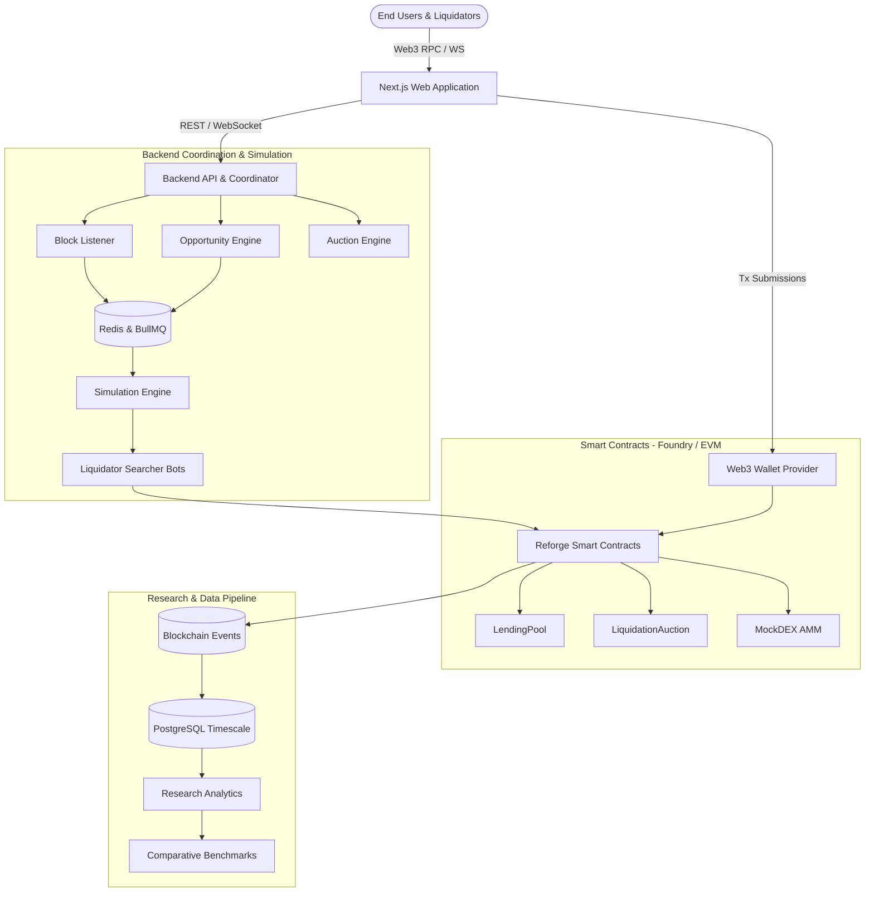

Reforge is organized into four interconnected layers spanning on-chain protocols, real-time backend coordination services, user/liquidator web applications, and an empirical simulation lab.

---

## High-Level Architecture Flow

---

## Architectural Layers

<Cards>
  <Card 
    icon={<FileCode />}
    title="Smart Contract Layer" 
    description="The foundational EVM financial layer — LendingPool, LiquidationAuction, and PriceOracle written in Solidity." 
    href="/docs/architecture/smart-contracts" 
  />
  <Card 
    icon={<Server />}
    title="Backend Infrastructure" 
    description="Real-time blockchain listener, BullMQ opportunity queue, scoring engine, and telemetry coordinator." 
    href="/docs/architecture/backend" 
  />
  <Card 
    icon={<LayoutDashboard />}
    title="Frontend Applications" 
    description="Next.js interfaces featuring the Protocol Dashboard, Liquidation Marketplace, and Research Lab." 
    href="/docs/architecture/frontend" 
  />
  <Card 
    icon={<Layers />}
    title="Overall Tech Stack" 
    description="Complete tooling breakdown across Foundry, Node.js, Fastify, PostgreSQL, Next.js, and Python." 
    href="/docs/architecture/tech-stack" 
  />
</Cards>

---

## Core System Responsibilities

| System Layer | Primary Technologies | Core Responsibilities |
| :--- | :--- | :--- |
| **Smart Contracts** | Solidity 0.8+, Foundry, OpenZeppelin | Custodies collateral, manages lending accounting, opens discrete batch auctions, and settles liquidation payouts atomically. |
| **Backend Services** | Node.js, TypeScript, Fastify, viem, Redis | Monitors blocks via WebSocket, detects underwater accounts ($HF < 1.0$), computes Net Economic Value scores, and dispatches jobs. |
| **Frontend Views** | Next.js 16, Tailwind CSS, Fumadocs | Provides user dashboard, liquidator bidding console, protocol telemetry, and interactive research simulator. |
| **Research Pipeline** | Python, NumPy, Pandas, Matplotlib | Orchestrates Monte Carlo market shocks, models gas wars vs. batch auctions, and generates empirical comparison figures. |
