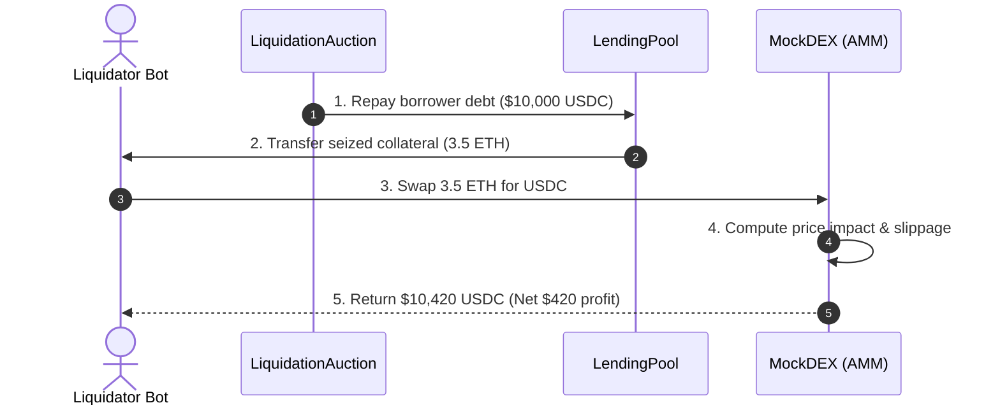

The smart contract layer forms the foundational financial system of Reforge. Written in **Solidity 0.8+** and tested with **Foundry**, these contracts handle collateral custody, loan accounting, price oracle ingestion, discrete batch auctions, and AMM swaps.

---

## Contract Directory Structure

<Files>
  <Folder name="contracts" defaultOpen>
    <File name="LendingPool.sol" />
    <File name="LiquidationAuction.sol" />
    <File name="LiquidationManager.sol" />
    <File name="PriceOracle.sol" />
    <File name="MockDEX.sol" />
    <File name="MockERC20.sol" />
    <Folder name="interfaces" defaultOpen>
      <File name="ILendingPool.sol" />
      <File name="ILiquidationAuction.sol" />
      <File name="IPriceOracle.sol" />
    </Folder>
    <Folder name="libraries" defaultOpen>
      <File name="HealthFactor.sol" />
    </Folder>
  </Folder>
</Files>

---

## Core Protocol Contracts

| Contract | Role | Core Responsibility |
| :--- | :--- | :--- |
| **`LendingPool.sol`** | Liquidity Hub | Manages user deposits, collateral locking, debt borrowing, repayments, and position balances. |
| **`LiquidationAuction.sol`** | Auction Coordinator | Central research mechanism: coordinates discrete batch auction windows, collects bids, and executes atomic settlements. |
| **`LiquidationManager.sol`** | Eligibility & Math | Evaluates account eligibility, computes maximum liquidatable debt ceilings, and calculates collateral transfer quantities. |
| **`PriceOracle.sol`** | Pricing Feed | Dual-mode pricing oracle supporting real-time Chainlink feeds as well as programmatic price shocks for simulations. |
| **`MockDEX.sol`** | AMM Simulation | Simulates constant-product AMM liquidity pools with configurable slippage curves and price impact models. |
| **`HealthFactor.sol`** | Math Library | Shared mathematical library implementing standardized precision-safe Health Factor calculations. |

---

## Contract Interfaces & Function Signatures

<Tabs items={['LendingPool', 'LiquidationAuction', 'LiquidationManager', 'PriceOracle']}>
  <Tab value="LendingPool">
    ```solidity
    interface ILendingPool {
        function deposit(address asset, uint256 amount) external returns (uint256);
        function withdraw(address asset, uint256 amount) external returns (uint256);
        function borrow(address asset, uint256 amount) external returns (uint256);
        function repay(address asset, uint256 amount) external returns (uint256);
        function getAccountData(address user) external view returns (
            uint256 totalCollateralETH,
            uint256 totalDebtETH,
            uint256 availableBorrowsETH,
            uint256 currentLiquidationThreshold,
            uint256 ltv,
            uint256 healthFactor
        );
    }
    ```
  </Tab>
  <Tab value="LiquidationAuction">
    ```solidity
    interface ILiquidationAuction {
        function openAuction(address borrower, uint256 debtToCover) external returns (bytes32 auctionId);
        function submitBid(bytes32 auctionId, uint256 minCollateralOut, bytes calldata routeData) external;
        function closeAuction(bytes32 auctionId) external;
        function settleAuction(bytes32 auctionId) external returns (address winner, uint256 bonusAwarded);
    }
    ```
  </Tab>
  <Tab value="LiquidationManager">
    ```solidity
    interface ILiquidationManager {
        function isLiquidatable(address borrower) external view returns (bool);
        function calculateCollateralToLiquidate(
            address borrower,
            address debtAsset,
            uint256 debtToCover
        ) external view returns (uint256 collateralAmount, uint256 liquidationBonus);
    }
    ```
  </Tab>
  <Tab value="PriceOracle">
    ```solidity
    interface IPriceOracle {
        function getAssetPrice(address asset) external view returns (uint256);
        function setAssetPrice(address asset, uint256 price) external; // Simulation mode
        function setDropPercentage(address asset, uint256 dropBps) external; // Flash crash shock
    }
    ```
  </Tab>
</Tabs>

---

## DEX Liquidation & Price Impact Flow

When liquidators seize collateral during high-volatility events, collateral must be immediately liquidated into debt assets (e.g., ETH $\to$ USDC) on an AMM. Reforge explicitly models this DEX slippage in Net Economic Value scoring:


