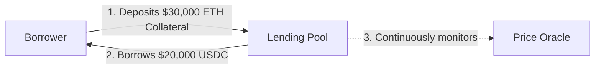
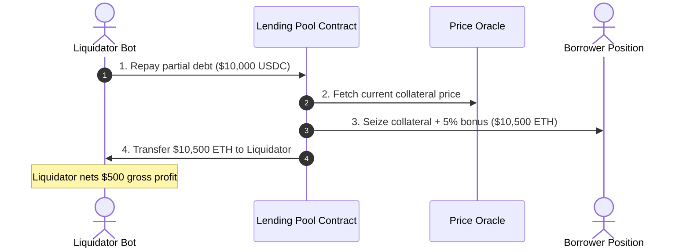

Decentralized Finance (DeFi) lending protocols allow users to borrow assets against cryptocurrency collateral without intermediaries or credit checks. Understanding these fundamental mechanics is essential to understanding why conventional liquidation systems fail under network congestion.

---

## Core Terminology

| Term | Definition | Role in Reforge |
| :--- | :--- | :--- |
| **Collateral (ETH)** | Volatile crypto asset deposited into a lending pool to back a loan. | Seized and sold during liquidation to cover debt. |
| **Debt Asset (USDC)** | Fiat-pegged stablecoin ($1.00 USD) borrowed by the user. | Repaid by the liquidator during liquidation. |
| **Overcollateralization** | The requirement that collateral value strictly exceeds borrowed value. | Provides a safety buffer against market price drops. |
| **Liquidation** | The programmatic sale of collateral to repay bad debt when loan health degrades. | The core process Reforge redesigns via batch auctions. |
| **Liquidation Bonus** | A predetermined discount (e.g. 5%) given to liquidators on seized collateral. | The profit incentive driving liquidator competition. |
| **Gas Fee** | Network transaction fee paid to blockchain validators for execution priority. | Currently wasted in Priority Gas Auctions (PGAs). |

---

## How DeFi Lending Works

In traditional finance, loans require credit scores and legal recourse. In DeFi, loans are completely trustless and secured through **overcollateralization**.



### The Overcollateralization Safety Margin

Because cryptocurrencies like ETH are volatile, protocols require borrowers to deposit more collateral than the value of debt they borrow.

<Tabs items={['Healthy Position', 'Market Drop (At Risk)', 'Insolvent (Liquidatable)']}>
  <Tab value="Healthy Position">
    ```
    Collateral: 10 ETH @ $3,000/ETH = $30,000
    Borrowed:   $20,000 USDC
    LTV Ratio:  $20,000 / $30,000 = 66.7%
    Threshold:  75.0%
    Status:     ✅ Safe (Healthy buffer)
    ```
  </Tab>
  <Tab value="Market Drop (At Risk)">
    ```
    ETH Price drops to $2,800:
    Collateral: 10 ETH @ $2,800/ETH = $28,000
    Borrowed:   $20,000 USDC
    LTV Ratio:  $20,000 / $28,000 = 71.4%
    Threshold:  75.0%
    Status:     ⚠️ Warning (Approaching liquidation threshold)
    ```
  </Tab>
  <Tab value="Insolvent (Liquidatable)">
    ```
    ETH Price drops to $2,600:
    Collateral: 10 ETH @ $2,600/ETH = $26,000
    Borrowed:   $20,000 USDC
    LTV Ratio:  $20,000 / $26,000 = 76.9%
    Threshold:  75.0%
    Status:     🚨 Liquidatable (Immediate liquidation trigger)
    ```
  </Tab>
</Tabs>

<Callout type="warn">
**Why liquidation is critical:** If the price of ETH falls below the debt value ($20,000) and the borrower walks away, the protocol incurs **bad debt** and lenders lose their funds. Liquidation must occur before this point.
</Callout>

---

## The Anatomy of a Liquidation

When a loan crosses the liquidation threshold, the protocol allows third-party actors (**Liquidators**, typically automated bots) to step in.



### Numerical Walkthrough

<Steps>
  <Step>
    #### 1. Position Breaches Threshold
    - **Collateral:** $26,000 ETH (10 ETH)
    - **Debt:** $20,000 USDC
    - **LTV Ratio:** 76.9% (exceeds 75% max threshold)
  </Step>
  <Step>
    #### 2. Liquidator Repays Partial Debt
    - The liquidator calls the smart contract and pays off **$10,000 USDC** of the borrower's debt.
    - Remaining Debt: `$20,000 - $10,000 = $10,000 USDC`.
  </Step>
  <Step>
    #### 3. Protocol Awards Discounted Collateral
    - The protocol calculates collateral repayment equal to the debt paid plus a **5% liquidation bonus**:
      `$10,000 + $500 = $10,500 worth of ETH`.
    - Liquidator receives **$10,500 in ETH** for spending $10,000 in USDC (Gross Profit = **$500**).
  </Step>
  <Step>
    #### 4. Restored Health State
    - **New Collateral:** `$26,000 - $10,500 = $15,500 ETH`.
    - **New Debt:** `$10,000 USDC`.
    - **New LTV Ratio:** `$10,000 / $15,500 = 64.5%` (well below 75% threshold, restoring safety).
  </Step>
</Steps>

---

## Next Up: The Structural Flaw

While this mechanism protects the protocol from bad debt in theory, in practice it sparks aggressive bot competition.

<Cards>
  <Card icon={<AlertTriangle />} title="The Problem: MEV & Priority Gas Auctions" description="How the race to liquidate first creates massive gas waste and extracts excessive value from borrowers." href="/docs/getting-started/problem-statement" />
</Cards>
