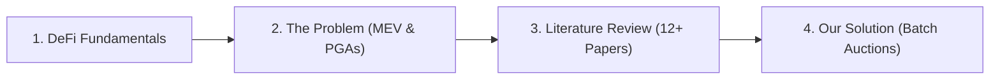

Welcome to the **Getting Started** section of Reforge. This section establishes the economic and technical foundations behind decentralized lending, demonstrates why conventional first-come liquidations fail under MEV competition, and outlines Reforge's batch auction solution.

---

## The Learning Journey

---

## Core Topics in this Section

<Cards>
  <Card 
    icon={<Coins />}
    title="DeFi Fundamentals" 
    description="Understand collateral deposits, borrowing, overcollateralization safety buffers, and liquidation bonuses." 
    href="/docs/getting-started/defi-fundamentals" 
  />
  <Card 
    icon={<AlertTriangle />}
    title="The Problem: MEV & PGAs" 
    description="How the race to liquidate first causes Priority Gas Auctions, extreme gas waste, and excessive borrower losses." 
    href="/docs/getting-started/problem-statement" 
  />
  <Card 
    icon={<Library />}
    title="Literature Review" 
    description="Deep-dive into 12+ seminal academic papers across DeFi liquidations, MEV, PBS, and consensus order-fairness." 
    href="/docs/getting-started/literature-review" 
  />
  <Card 
    icon={<Lightbulb />}
    title="Our Solution" 
    description="Explore how Reforge replaces PGAs with a discrete Batch Auction scored by Net Economic Value." 
    href="/docs/getting-started/our-solution" 
  />
</Cards>
