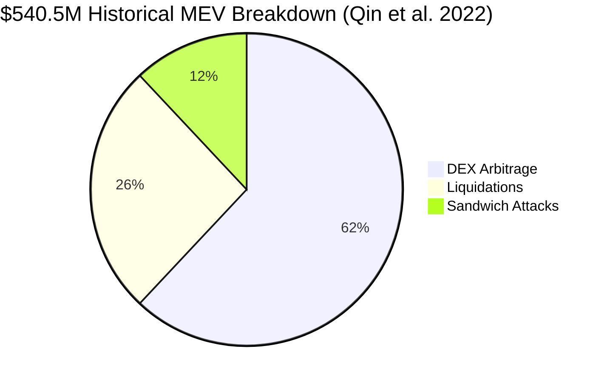
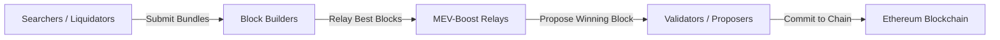

This section reviews the seminal literature establishing **Maximal Extractable Value (MEV)** as a fundamental property of transparent blockchain mempools and examining how Priority Gas Auctions (PGAs) distort transaction execution.

---

## 1. Flash Boys 2.0: Frontrunning, Transaction Reordering, and Consensus Instability

<Callout type="info">
**Citation:** Philip Daian, Steven Goldfeder, Tyler Kell, Tingwei Li, Yikai Zhao, Iddo Bentov, Lorenz Breidenbach, Ari Juels. *IEEE Symposium on Security and Privacy (S&P)*, 2019.  
[Read Paper (PDF)](https://arxiv.org/pdf/1904.05234)
</Callout>

### Core Takeaway (TL;DR)
Pending transactions in public mempools create arbitrage opportunities that automated bots exploit through **Priority Gas Auctions (PGAs)**. When extractable value is large enough, it threatens the **consensus security** of the blockchain itself.

### Key Insights & Findings

- **Priority Gas Auctions (PGAs)**: When multiple bots spot the same opportunity, they engage in continuous, high-frequency bidding wars—escalating gas prices in fractions of a second to win top block inclusion.
- **Block Positioning as Profit**: Proves that transaction ordering within a single block is not neutral; position itself carries substantial monetary value.
- **Time-Bandit Attacks**: Demonstrates that if MEV rewards exceed standard block subsidies, rational miners/validators are incentivized to **reorganize recent blocks** (forking history) to steal historical MEV opportunities.

<Callout type="warn">
### Relevance to Reforge
Establishes that a liquidation transaction cannot be treated as a simple atomic action: **who gets included first and where it is ordered relative to competitors is an extractable rent**. Reforge removes this rent by settling liquidations in discrete batch rounds.
</Callout>

---

## 2. Quantifying Blockchain Extractable Value: How Dark is the Forest?

<Callout type="info">
**Citation:** Kaihua Qin, Liyi Zhou, Arthur Gervais. *IEEE S&P*, 2022.  
[Read Paper (PDF)](https://discovery.ucl.ac.uk/id/eprint/10182325/1/2101.05511.pdf)
</Callout>

### Core Takeaway (TL;DR)
Measures over **$540.54 million in extracted value** across 32 months of Ethereum mainnet data, proving that liquidations represent one of the three primary systemic MEV pillars alongside DEX arbitrage and sandwich attacks.

### Key Empirical Metrics

- **Total Extracted Profit**: $540.54M captured across 11,000+ unique searcher addresses.
- **Largest Single Extraction**: A single liquidation opportunity yielded **$4.1 million** in profit.
- **Generalized Frontrunning & Transaction Replay**: Shows that sophisticated searchers monitor mempools to replay, duplicate, and outbid victim transactions without understanding their internal business logic.

<Callout type="warn">
### Relevance to Reforge
Provides empirical proof that liquidations are high-value systemic MEV targets. Bidding wars around liquidations are not edge cases—they represent hundreds of millions of dollars in extracted economic rent.
</Callout>

---

## 3. Ethereum Official MEV Documentation & Architecture

<Callout type="info">
**Source:** Ethereum Foundation Developer Documentation.  
[Read Official Docs](https://ethereum.org/developers/docs/mev/)
</Callout>

### Core Takeaway (TL;DR)
The official architectural specification of the modern MEV supply chain, formalizing the roles of **Searchers, Block Builders, Relays, and Proposers (Validators)**.

### The Modern MEV Supply Chain

- **Searchers**: Run complex algorithms to spot arbitrage, liquidations, and transaction-ordering opportunities.
- **Gas Golfing**: Searchers optimize contract bytecode and storage layout down to single gas units to minimize overhead and outbid rivals.
- **Value Leakage**: Confirms that competitive searchers surrender the vast majority of their margins to block proposers via direct builder payments (coinbase transfers).

---

## Next Literature Deep-Dive

<Cards>
  <Card title="3. PBS, Private Order Flow & Latency" description="How MEV-Boost, integrated builder monopolies, and timing games distort open competition." href="/docs/getting-started/literature-review/03-pbs-and-builder-markets" />
</Cards>
