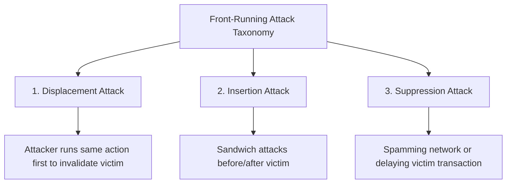

This section synthesizes theoretical literature on Byzantine consensus ordering guarantees, formal taxonomies of front-running attacks, and frameworks differentiating smart contract technical security from economic game-theoretic security.

---

## 1. Order-Fairness for Byzantine Consensus

<Callout type="info">
**Citation:** Mahimna Kelkar, Fan Zhang, Steven Goldfeder, Ari Juels. *CRYPTO*, 2020.  
[Read Paper (PDF)](https://eprint.iacr.org/2020/269.pdf)
</Callout>

### Core Takeaway (TL;DR)
Standard Byzantine consensus protocols only guarantee **consistency** (agreement on history) and **liveness** (transactions eventually get included). They fail to guarantee **order-fairness**, allowing block leaders to manipulate transaction sequence at will.

### Key Contributions & The Aequitas Protocol

- **Definition of Order-Fairness**: A consensus protocol is order-fair if, whenever a majority of honest nodes observe transaction $T_1$ before $T_2$, $T_1$ is guaranteed to be scheduled before $T_2$ in the final block sequence.
- **The Aequitas Family**: Introduces formal consensus constructions that prevent privileged latency actors and malicious leaders from extracting ordering rents.

<Callout type="warn">
### Relevance to Reforge
Proves that simply making liquidations open to all network nodes is insufficient if the underlying execution layer allows arbitrary ordering manipulation. Reforge enforces fair economic clearing at the application layer.
</Callout>

---

## 2. SoK: Transparent Dishonesty — Front-Running Attacks on Blockchain

<Callout type="info">
**Citation:** Shayan Eskandari, Seyedehmahsa Moosavi, Jeremy Clark. *Financial Cryptography and Data Security (FC)*, 2019.  
[Read Paper (PDF)](https://arxiv.org/pdf/1902.05164)
</Callout>

### Core Takeaway (TL;DR)
Formalizes a taxonomy classifying blockchain front-running attacks into **Displacement, Insertion, and Suppression**, surveying foundational defenses.

- **Displacement in Liquidations**: The classic liquidation race is a pure displacement attack: the searcher copies the victim's liquidation parameters and pays a higher gas fee to execute first, causing all competitor transactions to revert and waste gas.

---

## 3. Systematization of Knowledge (SoK) on DeFi Security & Risks

### A. SoK: Decentralized Finance (Werner et al., 2021)
[Read Paper (PDF)](https://arxiv.org/pdf/2101.08778)

- **Technical vs. Economic Security**: Smart contracts can have zero coding bugs (100% technical security) and yet suffer catastrophic failure due to **economic incentive vulnerabilities** and MEV extraction.
- **Cross-Layer Interactivity**: Analyzes how lending protocols, price oracles, and AMM DEXs interact, showing that liquidation events generate cross-protocol MEV cascades.

### B. SoK: DeFi Fundamentals, Taxonomy and Risks (Gogol et al., 2024)
[Read Paper (PDF)](https://arxiv.org/pdf/2404.11281)

- **Taxonomy of Lending Risk**: Maps protocol insolvency not just to smart contract exploits, but to market price volatility, external searcher bot incentives, and oracle update latency.
- **Liquidation Fragility**: Highlights that relying on uncoordinated third-party bots to liquidate debt creates severe fragility during high-volatility market crashes.

---

## Summary: How Literature Shaped Reforge

The collective body of academic literature points to three undeniable conclusions:

1. **Fixed liquidation discounts extract excessive value from borrowers** (Qin 2021, Tian 2025).
2. **First-come races in transparent mempools inevitably collapse into destructive MEV bidding wars** (Daian 2019, Qin 2022).
3. **PBS and MEV-Boost concentrate liquidation power among dominant block builders** (Pai 2023, Wang 2024).

<Callout type="tip">
**Reforge's Response:** A protocol-native **MEV-Aware Batch Auction** that evaluates liquidations on **Net Economic Value**, restoring economic efficiency, borrower equity, and fair market competition.
</Callout>

---

## Continue to Reforge Solution

<Cards>
  <Card title="Our Solution: The MEV-Aware Batch Auction" description="Explore the full mechanism design and Net Economic Value scoring formula." href="/docs/getting-started/our-solution" />
</Cards>
