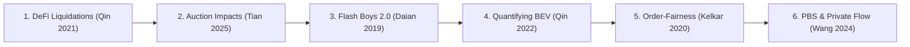

The design of Reforge builds upon extensive academic research across DeFi liquidation mechanics, Maximal Extractable Value (MEV), Proposer-Builder Separation (PBS), and consensus order-fairness.

Rather than treating liquidation as an isolated smart contract call, the literature demonstrates that liquidation is a multi-layered economic game played across mempools, block builders, and AMM secondary markets.

---

## Recommended Reading Pathway

For researchers and engineers onboarding to the Reforge protocol, prioritize papers in this sequence:

---

## Literature Categorization

<Cards>
  <Card icon={<Scale />} title="DeFi Liquidations & Market Impact" description="Empirical analyses of Aave, MakerDAO, and Compound; fixed discounts vs. competitive auctions." href="/docs/getting-started/literature-review/01-defi-liquidations" />
  <Card icon={<Zap />} title="MEV & Priority Gas Auctions" description="Foundational works on transaction reordering, PGA bidding dynamics, and value quantification." href="/docs/getting-started/literature-review/02-mev-foundations" />
  <Card icon={<Boxes />} title="PBS, Private Order Flow & Latency" description="Builder monopolies, MEV-Boost integration advantages, and strategic timing delays." href="/docs/getting-started/literature-review/03-pbs-and-builder-markets" />
  <Card icon={<ShieldCheck />} title="Fair Ordering & Protocol Security" description="Byzantine consensus order-fairness (Aequitas), front-running taxonomy, and DeFi security SoKs." href="/docs/getting-started/literature-review/04-fair-ordering-and-security" />
</Cards>

---

## Research Synthesis Matrix

| # | Paper / Study | Year | Key Finding | Relevance to Reforge |
| :--- | :--- | :--- | :--- | :--- |
| **1** | [Flash Boys 2.0](https://arxiv.org/abs/1904.05234) | 2019 | Priority Gas Auctions (PGAs) cause consensus instability and time-bandit risks. | Proves that block positioning itself is a source of extractable profit. |
| **2** | [Empirical Study of DeFi Liquidations](https://discovery.ucl.ac.uk/id/eprint/10150722/) | 2021 | Fixed liquidation discounts cause borrowers to lose excess collateral. | Establishes the necessity of value-based liquidation scoring. |
| **3** | [Quantifying Blockchain Extractable Value](https://discovery.ucl.ac.uk/id/eprint/10182325/) | 2022 | $540M+ extracted via arbitrage, sandwiching, and liquidations. | Quantifies liquidations as major systemic MEV attack surfaces. |
| **4** | [Order-Fairness for Byzantine Consensus](https://eprint.iacr.org/2020/269.pdf) | 2020 | Consistency and liveness do not prevent latency exploitation; introduces Aequitas. | Theoretical backing for batch windows over latency races. |
| **5** | [SoK: Decentralized Finance](https://arxiv.org/abs/2101.08778) | 2021 | Differentiates technical smart contract security from economic mechanism security. | Framework for analyzing liquidation incentive mechanisms. |
| **6** | [SoK: DeFi Fundamentals & Risks](https://arxiv.org/abs/2404.11281) | 2024 | Taxonomizes lending risks across market volatility, oracles, and liquidators. | Maps liquidation failure modes to external market structure. |
| **7** | [Liquidation Mechanisms & Price Impacts](https://www.bankofcanada.ca/wp-content/uploads/2025/03/swp2025-12.pdf) | 2025 | Maker auctions reduced price impact (0.01% vs. 0.054%) and discounts (1.8% vs. 5%). | **Direct validation**: Competitive auctions dramatically cut collateral loss. |
| **8** | [Integrated Builders in MEV-Boost](https://arxiv.org/abs/2311.09083) | 2023 | Vertically integrated searcher-builders gain unfair 2nd-price auction advantages. | Highlights why public mempool liquidations become centralized. |
| **9** | [Private Order Flows & Monopolies](https://arxiv.org/abs/2410.12352) | 2024 | Top 3 block builders capture >95% of blocks through private order flow. | Shows that exclusive builder deals distort open liquidation competition. |
| **10** | [Artificial Latency in PBS](https://arxiv.org/abs/2312.09654) | 2023 | Validators strategically delay block proposals to capture 1.28% additional MEV. | Demonstrates that timing manipulation affects liquidation capture. |
| **11** | [SoK: Front-Running Attacks](https://arxiv.org/abs/1902.05164) | 2019 | Classifies attacks into displacement, insertion, and suppression. | Formal vocabulary for classifying liquidation frontrunning. |
| **12** | [Ethereum MEV Docs](https://ethereum.org/developers/docs/mev/) | — | Official architectural specification of the MEV supply chain. | Standard terminology for searchers, builders, and gas golfing. |
| **13** | Recent 2026 Studies | 2026 | Transaction fees and gas prices materially determine OEV manipulation viability. | Informs Reforge's dynamic gas-aware scoring algorithm. |

---

## Deep-Dives by Topic

Explore the full analysis for each thematic area:

<Cards>
  <Card icon={<Scale />} title="Read Section 1: DeFi Liquidations" href="/docs/getting-started/literature-review/01-defi-liquidations" />
  <Card icon={<Zap />} title="Read Section 2: MEV Foundations" href="/docs/getting-started/literature-review/02-mev-foundations" />
</Cards>
