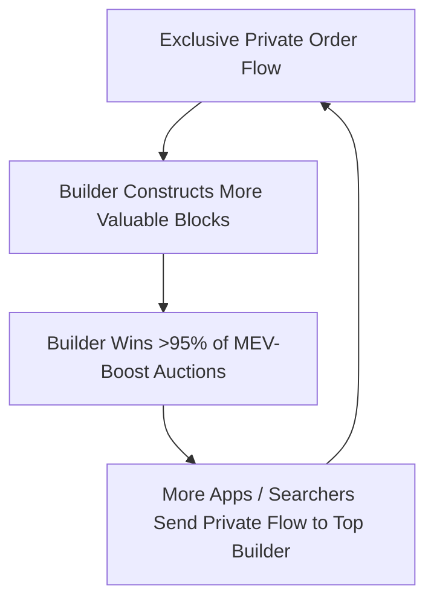

Following the introduction of Proposer-Builder Separation (PBS) via MEV-Boost, MEV competition shifted from the public mempool into specialized block-builder auctions. This section reviews literature examining how builder monopolies, private order flow, and latency games shape execution fairness.

---

## 1. Structural Advantages for Integrated Builders in MEV-Boost

<Callout type="info">
**Citation:** Mallesh Pai, Max Resnick. *arXiv preprint*, 2023.  
[Read Paper (PDF)](https://arxiv.org/pdf/2311.09083)
</Callout>

### Core Takeaway (TL;DR)
Block builders vertically integrated with their own proprietary searcher operations enjoy **unfair latency and informational advantages**, turning what should be a fair open auction into an asymmetric game where independent liquidators face the "winner's curse".

### Key Insights

- **Asymmetric Auction Dynamics**: Integrated searcher-builders can bid closer to block deadline because they face zero inter-entity network communication latency.
- **First-Price vs. Second-Price Asymmetry**: Independent searchers must submit fixed first-price bids to external builders, whereas integrated builders observe competitors' bundles in real time and bid just enough to win (effectively enjoying 2nd-price auction economics).
- **Winner's Curse**: Independent liquidators who bid too early risk market price movements making their liquidation unprofitable before block commitment.

<Callout type="warn">
### Relevance to Reforge
Proves that simply relying on MEV-Boost / private builder relays does not solve unfair liquidation competition; it merely shifts the advantage to vertically integrated block builders. Reforge provides protocol-level batch clearing that neutralizes builder latency advantages.
</Callout>

---

## 2. Private Order Flows and Builder Bidding Dynamics

<Callout type="info">
**Citation:** Shuzheng Wang, Tarun Chitra, Ciamac Moallemi et al. *arXiv preprint*, 2024/2025.  
[Read Paper (PDF)](https://arxiv.org/pdf/2410.12352)
</Callout>

### Core Takeaway (TL;DR)
Private order flow (transactions bypassing the public mempool) accounts for **54.59% of total block value**. The resulting feedback loop enables the **top 3 block builders to capture over 95% of Ethereum blocks**, threatening open market competition.

### Empirical Findings (Jan 2023 – May 2024)

- **Market Concentration**: The top 3 builders regularly construct >95% of all Ethereum mainnet blocks.
- **Mempool Exclusion**: When liquidations are sent via private order flow to dominant builders, independent liquidators monitoring the public mempool are completely shut out from competing.

---

## 3. The Cost of Artificial Latency in the PBS Context

<Callout type="info">
**Citation:** Umberto Natale, Michael Moser. *arXiv preprint*, 2023.  
[Read Paper (PDF)](https://arxiv.org/pdf/2312.09654)
</Callout>

### Core Takeaway (TL;DR)
Validators can systematically increase their MEV revenue by **intentionally delaying block proposal deadlines**, waiting until the last possible millisecond for higher bids to arrive.

### Key Analysis

- **Strategic Slowness**: Winning bids become increasingly valuable closer to the slot cutoff. Validators delaying proposals by 500–1000ms capture an estimated median **1.28% increase in MEV rewards**.
- **Systemic Risk**: Strategic latency games increase the rate of missed slots, chain forks, and network-level instability.
- **Liquidation Impact**: Liquidators who can optimize millisecond-level network transit to late-proposing validators capture more liquidation volume.

---

## Next Literature Deep-Dive

<Cards>
  <Card title="4. Fair Ordering & Protocol Security" description="Consensus-level order-fairness (Aequitas), front-running taxonomy, and DeFi security frameworks." href="/docs/getting-started/literature-review/04-fair-ordering-and-security" />
</Cards>
