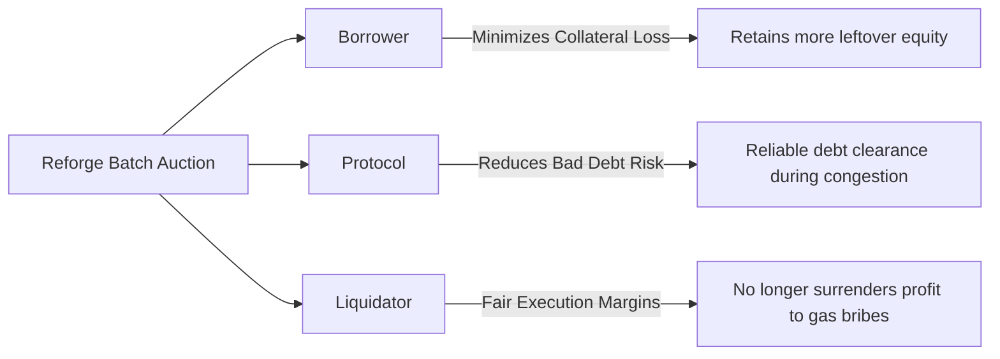
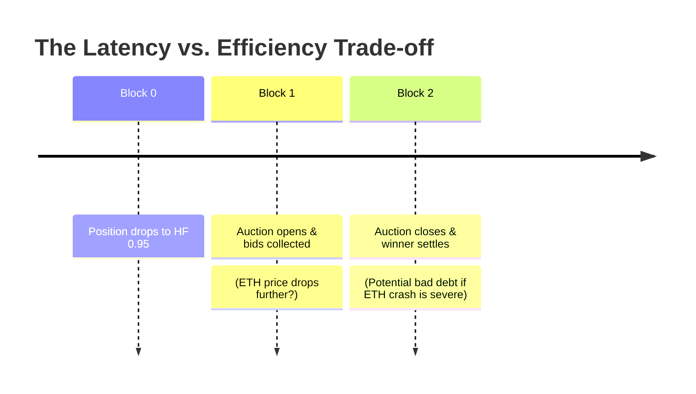

Reforge addresses the structural failure of Priority Gas Auctions by replacing latency-driven mempool races with a **discrete, time-windowed Batch Auction**.

Instead of rewarding whichever bot pays the largest gas bribe to a validator, Reforge evaluates competing bids on **Net Economic Value** and executes exactly one optimal liquidation per unhealthy position.

---

## Core Contribution

<Callout type="info">
### Working Title
**"A MEV-Aware Batch Auction Mechanism for DeFi Liquidations: Reducing Gas Competition and Collateral Loss"**

**Primary Contribution:**  
Design, implementation, and empirical evaluation of an end-to-end MEV-aware liquidation mechanism that explicitly accounts for liquidation profitability, transaction costs, competition, auction latency, and borrower/protocol outcomes.
</Callout>

---

## Mechanism Overview: From Race to Batch Auction

```mermaid
flowchart TD
    A[Unhealthy Position Detected HF < 1.0] --> B[1. Protocol Opens Auction Window]
    B --> C[2. Competing Liquidators Submit Bids]
    
    subgraph Liquidator Bids [Discrete Auction Window (1-2 Blocks)]
        B1[Liquidator A: $1000 Gross | $200 Gas | $80 Slip]
        B2[Liquidator B: $1000 Gross | $60 Gas | $40 Slip]
        B3[Liquidator C: $1000 Gross | $120 Gas | $20 Slip]
    end
    
    C --> B1
    C --> B2
    C --> B3
    
    B1 --> D[3. Scoring Function: Net Economic Value]
    B2 --> D
    B3 --> D
    
    D --> E[Winner Selected: Liquidator B ($900 Net)]
    E --> F[4. Settle Exactly ONE Liquidation Transaction]
```

---

## The Scoring Function: Net Economic Value

Conventional protocols accept the first valid transaction. Reforge scores all bids submitted during the auction window using an objective economic metric:

```
Net Economic Value = Gross Liquidation Value − Gas Cost − DEX/Slippage Cost
```

<Tabs items={['Bid Comparison Matrix', 'Why Winner B Wins']}>
  <Tab value="Bid Comparison Matrix">
    | Bidder | Gross Value | Gas Expenditure | DEX Slippage Impact | Net Economic Value | Rank / Decision |
    | :--- | :--- | :--- | :--- | :--- | :--- |
    | **Liquidator A** | $1,000 | $200 (High gas war) | $80 (High impact) | **$720** | ❌ 3rd Place |
    | **Liquidator B** | $1,000 | **$60 (Efficient routing)** | **$40 (Optimized AMM)** | **$900** | 🏆 **Winner** |
    | **Liquidator C** | $1,000 | $120 (Moderate gas) | $20 (Low impact) | **$860** | ❌ 2nd Place |
  </Tab>
  <Tab value="Why Winner B Wins">
    Even if Liquidator A attempts to frontrun by offering $200 in gas fees, **the protocol ignores transaction priority**. 

    Because Liquidator B routes trades with lower slippage and minimal gas overhead, it generates **$900 in true economic value** vs. Liquidator A's $720. Liquidator B is awarded the liquidation.
  </Tab>
</Tabs>

---

## Tripartite Alignment: Balancing All Three Stakeholders

A sustainable liquidation mechanism must align incentives across the three primary participants:



| Stakeholder | Conventional System (PGA) | Reforge MEV-Aware Batch Auction |
| :--- | :--- | :--- |
| **Borrower** | Suffers fixed, aggressive collateral penalties (5-10%). | Maximizes preserved equity by reducing unnecessary discounts. |
| **Protocol** | Transactions fail during mempool congestion; bad debt piles up. | Guaranteed single-transaction settlement with deterministic inclusion. |
| **Liquidator** | Surrenders 70-90% of gross margin to block proposers in gas bribes. | Retains profits based on execution and routing efficiency. |

---

## The Critical Research Trade-Off

Every architectural decision carries trade-offs. Introducing a batch auction window requires careful scientific evaluation.

<Callout type="warn">
### The Auction Latency Problem
In a conventional system, liquidation is immediate (next block). In Reforge, the auction window introduces a **1–2 block delay**.



During this 1–2 block window, if the collateral price experiences an extreme flash crash, the position could become underwater before settlement.
</Callout>

### The Central Research Question

> **Does the significant reduction in MEV gas waste and collateral loss outweigh the marginal risk introduced by auction latency?**

Our empirical research platform and simulation engine (`/docs/research`) are designed specifically to answer this question across historical and synthetic stress-test market conditions.

---

## Explore Next

<Cards>
  <Card icon={<Layers />} title="System Architecture" description="Explore the end-to-end architecture across contracts, backend, frontend, and simulation." href="/docs/architecture" />
  <Card icon={<ScrollText />} title="Specifications" description="Review the technical specifications for each contract and backend service." href="/docs/specs" />
</Cards>
