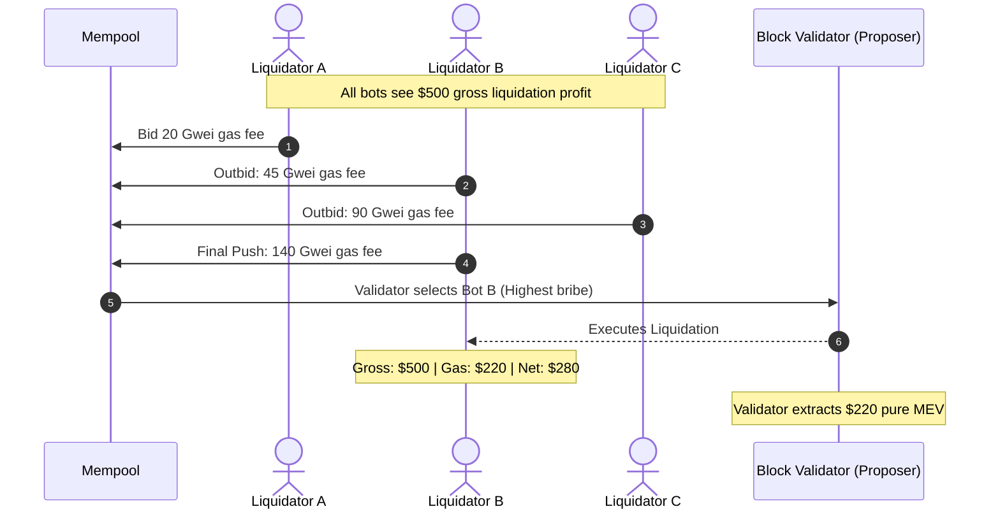

In conventional DeFi lending protocols (such as Aave, Compound, and MakerDAO), liquidation is designed around a **first-come, first-served** model. When a position becomes unhealthy, whoever submits the first valid liquidation transaction captures the profit.

This design inadvertently triggers intense **Maximal Extractable Value (MEV)** competition that damages borrowers, protocols, and the wider blockchain network.

---

## The Health Factor Metric

Lending protocols standardize position health using a single composite formula:

```
Health Factor (HF) = (Collateral Value × Liquidation Threshold) / Debt Value
```

<Callout type="info">
- **$HF > 1.0$**: The position is healthy and adequately collateralized.
- **$HF < 1.0$**: The position has breached the risk threshold and is immediately liquidatable by any network participant.
</Callout>

### Example Scenario

```
Collateral: 10 ETH @ $3,000/ETH = $30,000
Liquidation Threshold: 80% (0.8)
Borrowed Debt: $20,000 USDC

HF = ($30,000 × 0.8) / $20,000 = 1.20 (Healthy)
```

If ETH price plunges from **$3,000 to $2,300**:
```
New Collateral Value = $23,000
New HF = ($23,000 × 0.8) / $20,000 = 0.92 (Liquidatable!)
```

---

## The Core Failure: Priority Gas Auctions (PGAs)

When $HF < 1.0$, multiple automated searcher bots detect the exact same opportunity simultaneously. Because only the **first** transaction gets included, bots enter a **Priority Gas Auction (PGA)**.



### The Misalignment of Incentives

In a PGA, the winner is determined by **who can pay the highest bribe to the block validator**, not who executes the liquidation most economically for the borrower or protocol.

<Tabs items={['Gross vs Net Profit', 'Economic Breakdown']}>
  <Tab value="Gross vs Net Profit">
    | Participant | Gross Incentive | Gas Bid Paid | DEX Slippage | Net Liquidator Profit | Value Transferred to Validator |
    | :--- | :--- | :--- | :--- | :--- | :--- |
    | **Bot A** | $500 | $40 (20 gwei) | $20 | $440 (Failed / Replaced) | $0 |
    | **Bot B (Winner)** | $500 | **$220 (140 gwei)** | $30 | **$250** | **$220** |
    | **Bot C** | $500 | $150 (90 gwei) | $25 | $325 (Failed / Replaced) | $0 |
  </Tab>
  <Tab value="Economic Breakdown">
    ```
    Gross Liquidation Bonus:   $500.00  (Extracted from Borrower)
    ----------------------------------------------------------
    - Paid in Gas Bribes:      $220.00  (Transferred to Block Validator)
    - DEX Slippage & Fees:      $30.00  (Slippage on Collateral Dump)
    ==========================================================
    = Net Liquidator Profit:   $250.00  (Only 50% of incentive retained!)
    ```
  </Tab>
</Tabs>

---

## Systemic Negative Externalities

| Problem / Externality | Mechanism & Impact |
| :--- | :--- |
| **1. Massive Economic Gas Waste** | Liquidators surrender up to 70–90% of their gross margin in gas wars, directing capital away from DeFi utility and into validator pockets. |
| **2. Excessive Borrower Collateral Loss** | Borrowers suffer fixed 5–10% penalties regardless of whether market conditions require such heavy discounts to achieve liquidity. |
| **3. Cascading DEX Price Crashes** | Liquidators dump seized collateral rapidly on AMMs to lock in profits, causing localized slippage and triggering secondary liquidations. |
| **4. Consensus Instability** | High MEV rewards create incentives for time-bandit attacks, transaction reordering, block reorganizations, and validator timing games. |

---

## The Central Research Questions

<Callout type="warn">
### Research Question 1
**Does competitive MEV extraction make DeFi liquidation unnecessarily expensive and amplify the economic damage suffered by borrowers?**
</Callout>

<Callout type="warn">
### Research Question 2
**Can the liquidation mechanism be redesigned so that competition is based on economic efficiency rather than a race to submit the highest-priority gas bribe?**
</Callout>

---

## Next Up: Academic Literature & Our Solution

<Cards>
  <Card icon={<Library />} title="Literature Review" description="Examine 12 foundational academic papers analyzing DeFi liquidations, MEV, and order-fairness." href="/docs/getting-started/literature-review" />
  <Card icon={<Lightbulb />} title="Our Solution" description="How Reforge's MEV-Aware Batch Auction replaces PGAs with Net Economic Value scoring." href="/docs/getting-started/our-solution" />
</Cards>
