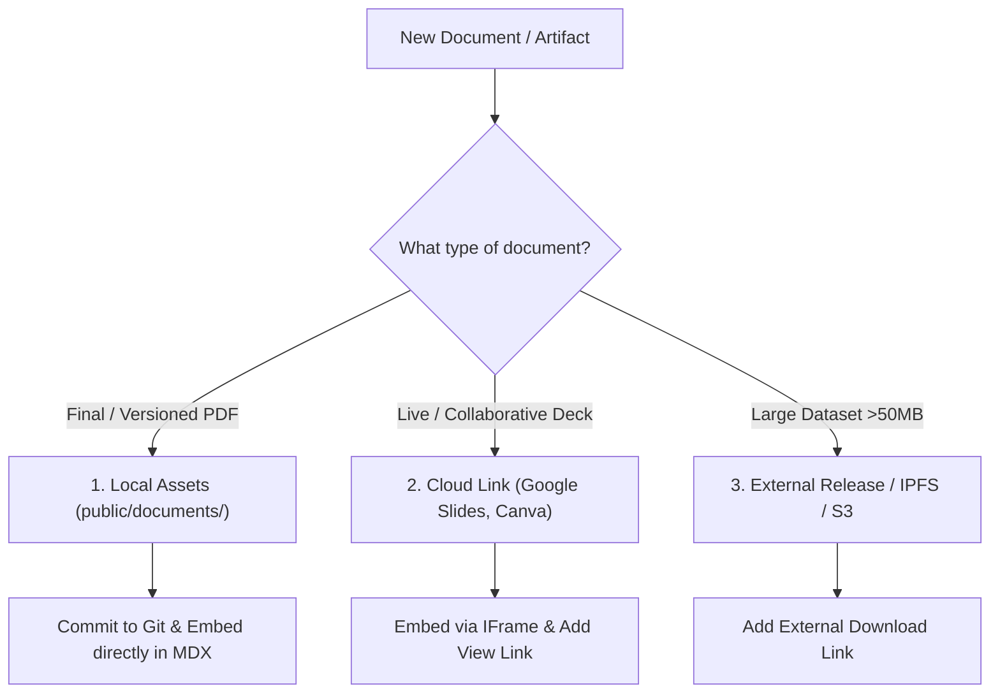

This section serves as the repository for all non-markdown project artifacts—including academic paper drafts, technical presentations (PPT/Keynote), architecture slide decks, and external references.

---

## Quick Navigation

<Cards>
  <Card 
    icon={<FileText />}
    title="Whitepapers & Research Papers" 
    description="Working papers, formal mechanism proofs, empirical evaluation drafts, and BibTeX citations." 
    href="/docs/resources/whitepapers-and-papers" 
  />
  <Card 
    icon={<Presentation />}
    title="Slide Decks & Presentations" 
    description="Team presentation decks, technical architecture walkthroughs, and conference slides." 
    href="/docs/resources/slide-decks" 
  />
</Cards>

---

## How to Manage Documents in this Project

We recommend a hybrid management workflow depending on the file type and update frequency:

### 1. Local Files (`public/documents/`)
For finalized PDFs, whitepapers, and exported slide decks:
- Place files in `public/documents/<filename>.pdf`
- Reference them directly in MDX using `/documents/<filename>.pdf`
- **Benefits:** Offline access, version-controlled with the repository, fast loading.

### 2. Live Cloud Decks (Google Slides / Pitch.com)
For working presentations that your team updates regularly:
- Keep the master deck in Google Slides or Pitch
- Embed the view-only iframe into `content/docs/resources/slide-decks.mdx`
- **Benefits:** No need to re-export or recommit files after every minor edit.

---

## Document Inventory

| Title | Type | Format | Location | Status |
| :--- | :--- | :--- | :--- | :--- |
| **MEV-Aware DeFi Liquidation System** | Review Paper | PDF (220 KB) | `/documents/MEV_Aware_DeFi_Liquidation_System.pdf` | ✅ `Available` |
| **System Architecture Walkthrough** | Presentation | Slides / PDF | `/documents/architecture-deck.pdf` | `Planned` |
| **MEV Batch Auction Pitch Deck** | Slide Deck | Google Slides / PPT | Cloud Link | `In Progress` |
| **Empirical Simulation Benchmarks** | Data Report | PDF | `/documents/simulation-report.pdf` | `Pending` |
